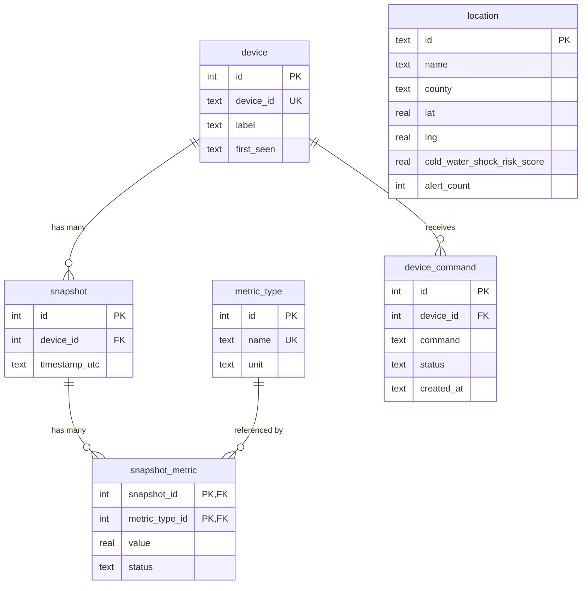

# VroomVroom Dashboard — System Architecture Diagram

This document provides a comprehensive visual overview of the VroomVroom monitoring system.

---

## 1. High-Level System Overview

```
┌─────────────────────────────────────────────────────────────────────────────────────────────────────────┐
│                                    VROOMVROOM DASHBOARD SYSTEM                                            │
├─────────────────────────────────────────────────────────────────────────────────────────────────────────┤
│                                                                                                           │
│   ┌──────────────┐   ┌──────────────┐   ┌──────────────┐   ┌──────────────┐   ┌──────────────┐          │
│   │   PC / OS    │   │   YouTube    │   │   Firebase   │   │   SwimScape  │   │   Browser    │          │
│   │   (psutil)   │   │  Data API    │   │  Firestore   │   │   (mobile)    │   │   (User)     │          │
│   └──────┬───────┘   └──────┬───────┘   └──────┬───────┘   └──────┬───────┘   └──────┬───────┘          │
│          │                  │                  │                  │                  │                   │
│          ▼                  ▼                  ▼                  ▼                  │                   │
│   ┌─────────────────────────────────────────────────────────────────────┐          │                   │
│   │                     COLLECTORS & INGESTION                             │          │                   │
│   │  main.py (one-shot)  │  collector_agent  │  tcp_client  │  mobile_upload │          │                   │
│   │  backfill_mobile     │  third_party (YT) │              │  run_all_collectors │      │                   │
│   └─────────────────────────────────────────────────────────────────────┘          │                   │
│          │                  │                  │                  │                  │                   │
│          └──────────────────┴──────────────────┴──────────────────┘                  │                   │
│                                     │                                                 │                   │
│                                     ▼                                                 │                   │
│   ┌─────────────────────────────────────────────────────────────────────┐             │                   │
│   │                    FLASK WEB APP (port 5000)                          │◄────────────┘                   │
│   │  /hello  /health  /metrics  /youtube/vroom-vroom  /orm/*  /mobile/*   │   HTTP                         │
│   │  /dashboard/  (React SPA)                                            │                                 │
│   └─────────────────────────────────────────────────────────────────────┘                                 │
│          │                                                                                                 │
│          ▼                                                                                                 │
│   ┌──────────────────┐   ┌──────────────────┐   ┌──────────────────┐                                      │
│   │  SQLite /        │   │  Backup Logs     │   │  Config          │                                      │
│   │  PostgreSQL      │   │  snapshot_backup │   │  config.json     │                                      │
│   │  (vroomvroom.db) │   │  failed_snapshots│   │  .env            │                                      │
│   └──────────────────┘   └──────────────────┘   └──────────────────┘                                      │
│                                                                                                           │
└─────────────────────────────────────────────────────────────────────────────────────────────────────────┘
```

---

## 2. Data Flow Diagram

```
                                    DATA SOURCES
                                         │
    ┌────────────────────┬──────────────┼──────────────┬────────────────────┐
    │                    │              │              │                    │
    ▼                    ▼              ▼              ▼                    ▼
┌─────────┐      ┌─────────────┐  ┌──────────┐  ┌─────────────┐      ┌──────────┐
│ metrics_│      │youtube_     │  │ mobile_   │  │ Firebase    │      │ TCP      │
│ reader  │      │ fetcher    │  │ collector│  │ Firestore   │      │ client   │
│ (psutil)│      │ (API v3)   │  │          │  │ (SwimScape) │      │ (JSON)   │
└────┬────┘      └──────┬─────┘  └────┬─────┘  └──────┬──────┘      └────┬─────┘
     │                  │             │               │                  │
     │  thread_count    │ view_count  │ water_temp    │ water_temp       │ length-prefixed
     │  ram_percent     │ like_count  │ risk_score    │ safety_alerts    │ JSON snapshot
     │  disk_usage_%    │             │               │                  │
     └──────────────────┴─────────────┴───────────────┴──────────────────┘
                                        │
                                        ▼
                    ┌───────────────────────────────────────┐
                    │     UNIFIED SNAPSHOT DTO (JSON)         │
                    │  { device_id, timestamp_utc, metrics }  │
                    │  metrics: [{ name, value, unit, status}]│
                    └───────────────────┬─────────────────────┘
                                        │
                    ┌───────────────────┼───────────────────┐
                    │                   │                   │
                    ▼                   ▼                   ▼
            ┌──────────────┐   ┌──────────────┐   ┌──────────────┐
            │ POST /orm/   │   │ TCP server   │   │ GET /metrics │
            │ upload_      │   │ (port 54545) │   │ (cached)     │
            │ snapshot     │   │ (log only)   │   │              │
            └──────┬───────┘   └──────────────┘   └──────┬───────┘
                   │                                      │
                   ▼                                      │
            ┌──────────────┐                             │
            │ ORM / DB     │                             │
            │ (persist)    │                             │
            └──────┬───────┘                             │
                   │                                      │
                   └──────────────────┬───────────────────┘
                                      │
                                      ▼
                    ┌───────────────────────────────────────┐
                    │     FRONTEND (React Dashboard)          │
                    │  /orm/snapshots/latest, /orm/snapshots │
                    │  /orm/locations, /orm/thresholds        │
                    │  Gauges, Charts, Ireland Map, Badges    │
                    └───────────────────────────────────────┘
```

---

## 3. Component Architecture (Mermaid)

```mermaid
flowchart TB
    subgraph EXTERNAL["External Data Sources"]
        PC[PC / OS<br/>psutil]
        YT[YouTube Data API v3]
        FB[(Firebase Firestore)]
    end

    subgraph COLLECTORS["Collectors"]
        MAIN[main.py<br/>one-shot read]
        AGENT[collector_agent.py<br/>long-running loop]
        TCP_CLIENT[tcp_client.py<br/>single snapshot]
        MOBILE_UP[mobile_upload.py<br/>Firestore → API]
        BACKFILL[backfill_mobile.py<br/>one-time historical]
        RUN_ALL[run_all_collectors.py<br/>YouTube + mobile]
    end

    subgraph TRANSPORT["Transport"]
        TCP_SRV[tcp_server.py<br/>port 54545]
        FLASK[Flask Web App<br/>port 5000]
    end

    subgraph API["API Endpoints"]
        HELLO[/hello]
        HEALTH[/health]
        METRICS[/metrics<br/>cached TTL]
        YT_ROUTE[/youtube/vroom-vroom]
        ORM[/orm/*<br/>snapshots, devices, upload]
        MOBILE_ROUTES[/mobile/*<br/>locations, snapshot]
        DASH[/dashboard/<br/>React SPA]
    end

    subgraph STORAGE["Storage"]
        DB[(SQLite / PostgreSQL)]
        BACKUP[snapshot_backup.jsonl]
        FAILED[failed_snapshots.jsonl]
    end

    subgraph FRONTEND["Frontend"]
        REACT[React + Vite]
        GAUGES[GaugeTachometer<br/>GaugeFuel<br/>GaugeSpeedometer]
        CHARTS[HistoricCharts]
        MAP[IrelandMap]
        BADGES[ViewCountBadge<br/>LikeCountBadge<br/>AlertCountBadge]
    end

    PC --> MAIN
    PC --> AGENT
    YT --> AGENT
    YT --> YT_ROUTE
    FB --> MOBILE_UP
    FB --> BACKFILL
    FB --> MOBILE_ROUTES

    MAIN --> TCP_CLIENT
    AGENT --> ORM
    TCP_CLIENT --> TCP_SRV
    MOBILE_UP --> ORM
    BACKFILL --> ORM

    TCP_SRV -.->|log only| TCP_SRV
    FLASK --> HELLO
    FLASK --> HEALTH
    FLASK --> METRICS
    FLASK --> YT_ROUTE
    FLASK --> ORM
    FLASK --> MOBILE_ROUTES
    FLASK --> DASH

    ORM --> DB
    ORM --> BACKUP
    ORM --> FAILED
    YT_ROUTE --> DB

    DASH --> REACT
    REACT --> GAUGES
    REACT --> CHARTS
    REACT --> MAP
    REACT --> BADGES

    FRONTEND -->|fetch| ORM
    FRONTEND -->|fetch| MOBILE_ROUTES
```

---

## 4. Database Schema



---

## 5. Data Model Layers

```
┌─────────────────────────────────────────────────────────────────────────────────┐
│  LAYER 1: DATABASE (normalized tables)                                           │
│  device | metric_type | snapshot | snapshot_metric | device_command | location    │
└─────────────────────────────────────────────────────────────────────────────────┘
                                        │
                                        ▼
┌─────────────────────────────────────────────────────────────────────────────────┐
│  LAYER 2: ORM (SQLAlchemy - orm_models.py)                                        │
│  Device | MetricType | Snapshot | SnapshotMetric | DeviceCommand | Location      │
└─────────────────────────────────────────────────────────────────────────────────┘
                                        │
                                        ▼
┌─────────────────────────────────────────────────────────────────────────────────┐
│  LAYER 3: SERVER DOMAIN (datasnapshot/models.py, snapshots.py)                    │
│  Snapshot | Metric | StatusSummary | SnapshotSummary | SnapshotDetail            │
└─────────────────────────────────────────────────────────────────────────────────┘
                                        │
                                        ▼
┌─────────────────────────────────────────────────────────────────────────────────┐
│  LAYER 4: DTO (wire JSON - orm_dto.py)                                           │
│  { device_id, timestamp_utc, metrics: [{ name, value, unit, status }] }           │
└─────────────────────────────────────────────────────────────────────────────────┘
```

---

## 6. Collector Agent Loop

```
┌─────────────────────────────────────────────────────────────────────────────────┐
│  COLLECTOR AGENT (python -m src.main --agent --interval N)                       │
├─────────────────────────────────────────────────────────────────────────────────┤
│                                                                                   │
│   ┌─────────────────────────────────────────────────────────────────────────┐    │
│   │  LOOP (start-based scheduling: next_run = loop_start + interval)         │    │
│   │                                                                         │    │
│   │  1. read_metrics() → create_snapshot() → DTO                             │    │
│   │  2. POST /orm/upload_snapshot (retry with exponential backoff)           │    │
│   │  3. get_video_statistics() → YouTube DTO → POST /orm/upload_snapshot      │    │
│   │  4. collect_and_upload() mobile (Firestore → API)                        │    │
│   │  5. sleep until loop_start + interval                                    │    │
│   └─────────────────────────────────────────────────────────────────────────┘    │
│                                                                                   │
│   Background: Command poll thread (every 10s)                                     │
│   GET /orm/commands/pending?device_id=pc-01 → execute play_alert (open YouTube)   │
│                                                                                   │
│   Graceful shutdown: SIGTERM/SIGINT sets flag; exits after current iteration     │
│                                                                                   │
└─────────────────────────────────────────────────────────────────────────────────┘
```

---

## 7. API Endpoints Summary

| Category | Endpoint | Method | Description |
|----------|----------|--------|-------------|
| **Core** | `/hello` | GET | "Hello World" |
| | `/health` | GET | Health check (200 OK) |
| | `/metrics` | GET | Live PC metrics (cached 30s) |
| **YouTube** | `/youtube/vroom-vroom` | GET | Fetch view/like count, store snapshot |
| **ORM** | `/orm/snapshots` | GET, POST | List/create snapshots |
| | `/orm/snapshots/<id>` | GET | Snapshot detail |
| | `/orm/snapshots/latest` | GET | Latest snapshot per device |
| | `/orm/devices` | GET | List devices |
| | `/orm/upload_snapshot` | POST | Upload JSON DTO (collectors) |
| | `/orm/thresholds` | GET | Danger thresholds |
| | `/orm/locations` | GET | Locations (map markers) |
| | `/orm/commands` | POST | Create device command |
| | `/orm/commands/pending` | GET | Poll pending commands |
| **Mobile** | `/mobile/locations` | GET | Firestore locations |
| | `/mobile/metrics/latest` | GET | Latest metrics per location |
| | `/mobile/metrics/history` | GET | Time-series for charts |
| | `/mobile/snapshot` | GET | Unified snapshot (same shape as PC) |
| **Frontend** | `/dashboard/` | GET | React SPA (gauges, charts, map) |

---

## 8. Configuration & Environment

```
config/config.json                    .env (not committed)
├── app_name                          ├── YOUTUBE_API_KEY
├── device_id                         ├── DATABASE_URL (PostgreSQL)
├── read_interval_seconds             ├── VROOMVROOM_CONFIG
├── danger_thresholds                ├── VROOMVROOM_DB
├── server_host, server_port          ├── VROOMVROOM_API_URL
├── mobile.enabled                    ├── VROOMVROOM_WEB_PORT
├── mobile.firebase_credentials_path  └── GOOGLE_APPLICATION_CREDENTIALS
├── mobile.collections
├── mobile.time_series_sources
└── mobile.count_sources
```

---

## 9. Deployment Topology

```
                    ┌─────────────────────────────────────────┐
                    │  VM (200.69.13.70)                       │
                    │  student@... -p 2210                     │
                    │                                          │
                    │  ┌────────────────────────────────────┐  │
                    │  │  gunicorn wsgi:application          │  │
                    │  │  --bind 0.0.0.0:5000 --workers 2   │  │
                    │  └────────────────────────────────────┘  │
                    │                                          │
                    │  Serves: /hello, /health, /metrics,       │
                    │          /orm/*, /mobile/*, /dashboard/  │
                    │                                          │
                    │  frontend/dist (npm run build)           │
                    └─────────────────────────────────────────┘
                                        ▲
                                        │ HTTP
                    ┌───────────────────┴───────────────────┐
                    │  Browser: http://200.69.13.70:5000/    │
                    │  - /dashboard/ (React)                 │
                    │  - /health, /metrics, etc.             │
                    └───────────────────────────────────────┘

  Optional (separate machine):
  - collector_agent (python -m src.main --agent)
  - tcp_server (python -m src.tcp_server)
  - tcp_client (python -m src.tcp_client)
```

---

*Generated from VroomVroom-Dashboard codebase. See README.md and docs/ for detailed documentation.*
